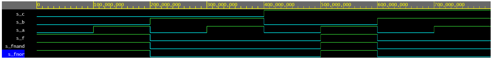
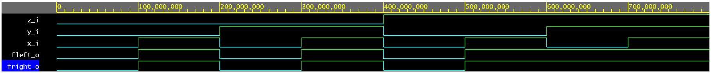

# Lab 1: Tomas Kristek 230278

### De Morgan's laws

1. Equations of all three versions of logic function f(c,b,a):

   

2. Listing of VHDL architecture from design file (`design.vhd`) for all three functions. Always use syntax highlighting, meaningful comments, and follow VHDL guidelines:

```vhdl
architecture dataflow of demorgan is
begin
    f_o    	<= (not b_i and a_i) or (not c_i and not b_i);
    fnand_o 	<= (not b_i nand a_i) nand (not c_i nand not b_i);
    fnor_o 	<= (a_i nor not c_i) nor b_i;
end architecture dataflow;
```

3. Complete table with logic functions' values:

| **c** | **b** |**a** | **f(c,b,a)** | **f_NAND(c,b,a)** | **f_NOR(c,b,a)** |
| :-: | :-: | :-: | :-: | :-: | :-: |
| 0 | 0 | 0 | 1 | 1 | 1 |
| 0 | 0 | 1 | 1 | 1 | 1 |
| 0 | 1 | 0 | 0 | 0 | 0 |
| 0 | 1 | 1 | 0 | 0 | 0 |
| 1 | 0 | 0 | 0 | 0 | 0 |
| 1 | 0 | 1 | 1 | 1 | 1 |
| 1 | 1 | 0 | 0 | 0 | 0 |
| 1 | 1 | 1 | 0 | 0 | 0 |

4. Screenshot with simulated time waveforms.

   

5. Link to your public EDA Playground example:

   [DeMorgan's Law - EDA](https://www.edaplayground.com/x/CxA9)

### Distributive laws

1. Distributive laws 

   

2. Screenshot with simulated time waveforms. Always display all inputs and outputs (display the inputs at the top of the image, the outputs below them) at the appropriate time scale!

   

3. Link to your public EDA Playground example:

   [Distribution Law - EDA](https://www.edaplayground.com/x/AWey)

