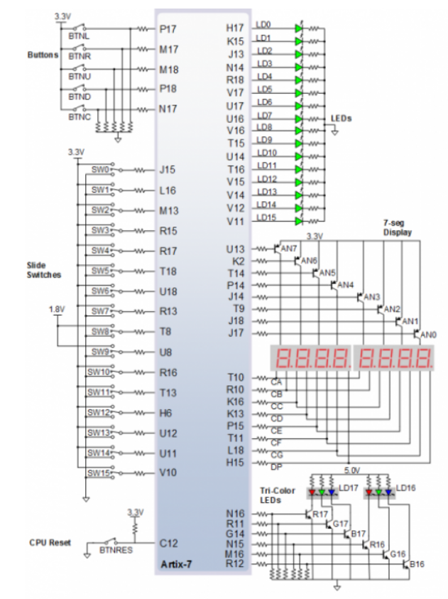

## Preparation tasks (done before the lab at home)

1. Slide switches

Slide switches generate constant high or low inputs depending on their position.

2. LED configuration

The sixteen individual high-efficiency LEDs are anode-connected to the FPGA via 330-ohm resistors, so they will turn on when a logic high voltage is applied to their respective I/O pin.

### Schematic of PIN Connection

