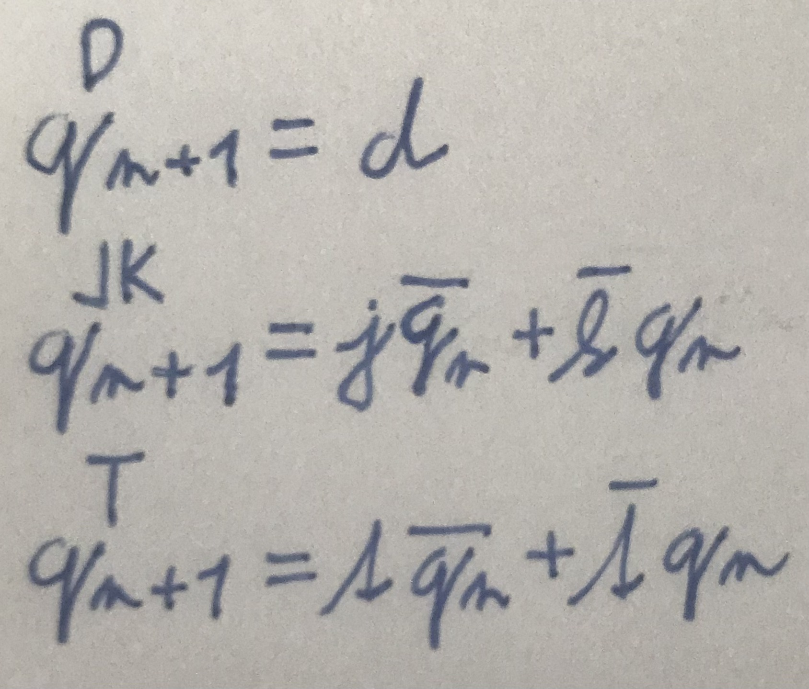

## Preparation tasks (done before the lab at home)

1. Write characteristic equations and complete truth tables for D, JK, T flip-flops where `q(n)` represents main output value before the clock edge and `q(n+1)` represents value after the clock edge.

   **D-type FF**
   | **clk** | **d** | **q(n)** | **q(n+1)** | **Comments** |
   | :-: | :-: | :-: | :-: | :-: |
   |  | 0 | 0 | 0 | q(n+1) has the same level as d |
   |  | 0 | 1 | 0 | q(n+1) has the same level as d |
   |  | 1 | 0 | 1 | Sampled at rising edge |
   |  | 1 | 1 | 1 | Sampled at rising edge |

   **JK-type FF**
   | **clk** | **j** | **k** | **q(n)** | **q(n+1)** | **Comments** |
   | :-: | :-: | :-: | :-: | :-: | :-- |
   |  | 0 | 0 | 0 | 0 | Output did not change |
   |  | 0 | 0 | 1 | 1 | Output did not change |
   |  | 0 | 1 | 0 | 0 | Reset |
   |  | 0 | 1 | 1 | 0 | Reset |
   |  | 1 | 0 | 0 | 1 | Set |
   |  | 1 | 0 | 1 | 1 | Set |
   |  | 1 | 1 | 0 | 1 | Toggle |
   |  | 1 | 1 | 1 | 0 | Toggle |

   **T-type FF**
   | **clk** | **t** | **q(n)** | **q(n+1)** | **Comments** |
   | :-: | :-: | :-: | :-: | :-- |
   |  | 0 | 0 | 0 | Output did not change |
   |  | 0 | 1 | 1 | Output did not change |
   |  | 1 | 0 | 1 | Invert (Toggle) |
   |  | 1 | 1 | 0 | Invert (Toggle) |
